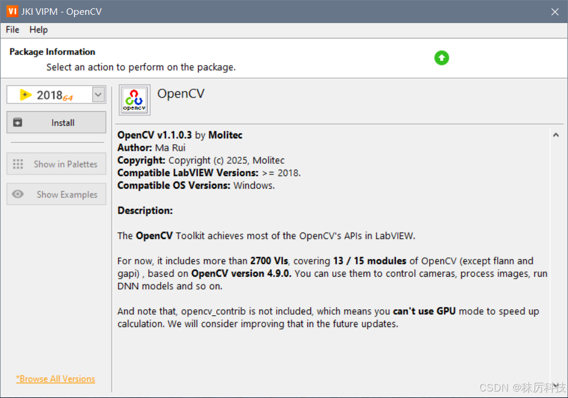

# labview-opencv

Hello everyone, 

I developed an Addons-Toolkit of LabVIEW, which achieves most of the OpenCV's APIs. 

It includes more than 2700 VIs, covering 13/15 modules of OpenCV (except flann and gapi) . You can use it to control cameras, process images, run DNN models and so on.

Welcome to my CSDN blog to download and give it a try!  (Chargeable, 30 days trial)
[https://blog.csdn.net/VIRobotics_MR/article/details/145945814](https://blog.csdn.net/VIRobotics_MR/article/details/145945814)

Requirements: Windows 10 or 11, LabVIEW>=2018, 32 or 64 bits. 

